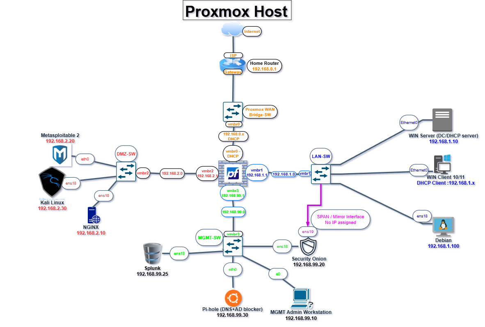

# 🧠 Proxmox Cybersecurity Home Lab

This project is a virtualized cybersecurity and IT operations lab built using **Proxmox VE** on a Mini PC. It simulates real-world enterprise environments with firewalls, VLANs, DNS filtering, intrusion detection, Windows domain control, and more.

---

## 🧰 Lab Highlights

- **Proxmox VE** as the hypervisor with multiple virtual bridges (vmbr0–3)
- **pfSense** firewall for WAN/LAN/DMZ/MGMT segmentation
- **Pi-hole** for DNS filtering and ad blocking
- **Security Onion** for network monitoring and IDS
- **Splunk** for centralized log collection and SIEM
- **Windows Server 2019** as a Domain Controller and DHCP server
- **Windows 10** client machines joined to AD
- **Debian/Ubuntu** Linux servers (Ansible, Pi-hole)
- **Metasploitable2** for vulnerability testing
- **Kali Linux** for penetration testing
- **Ansible** for automation and playbook execution

---

## 🔧 Tools Used

| Tool            | Purpose                         |
|----------------|----------------------------------|
| Proxmox VE      | Virtualization Host             |
| pfSense         | Firewall, Routing, NAT, DHCP    |
| Security Onion  | Intrusion Detection             |
| Splunk          | Log Analysis and SIEM           |
| Pi-hole         | DNS Filtering and Ad Blocking   |
| Kali Linux      | Penetration Testing             |
| Metasploitable2 | Target System for Attacks       |
| Ansible         | Configuration Management        |
| Windows Server  | Active Directory + DHCP         |
| GLPI            | Ticketing System (Planned)      |

---

## 🧪 Goals and Use Cases

- 🔐 Learn blue team operations (IDS, firewall rules, DNS filtering)
- 🛠️ Practice sysadmin tasks (GPO, RDP, DHCP, AD, domain join)
- 🧰 Automate provisioning and updates with Ansible
- 🧱 Build infrastructure for SOC/NOC environments
- 📶 Document labs for portfolio, resume, and LinkedIn

---

## 🔍 Screenshots

> Screenshots will be uploaded in the `images/` folder and shown here.

- Network Topology (draw.io)
- pfSense firewall rules
- Pi-hole dashboard
- Security Onion logs
- Splunk dashboard
- Proxmox web interface with VMs running

---

**
## 📁 File Structure

---

## 🧠 What I Learned

- Network segmentation using pfSense and vmbr interfaces
- How DNS and DHCP services operate across VLANs
- Security monitoring using Security Onion and Splunk
- Deploying services using containers and virtual machines
- Ansible playbook creation and system automation
- Simulating enterprise environments in a home lab

---

## 🔜 Future Plans

- ✅ GLPI ticketing system for Helpdesk simulation
- ✅ Ansible playbooks for mass configuration
- ✅ Domain Group Policy Objects (GPO) for USB lockdown
- ✅ Remote Desktop Services on Windows Server
- ✅ DNS Sinkholing & Custom Blocklists
- ✅ Zabbix for network resource monitoring
- ✅ Documenting helpdesk-style labs for job readiness

---

> 💡 This lab project is part of my journey in transitioning from academic training (Bachelor’s in Cybersecurity + CCNA) to real-world IT and cybersecurity operations.

📌 [Connect with me on LinkedIn](www.linkedin.com/in/john-slaughter-08a872262)  
📁 [Project repo on GitHub](https://github.com/yourusername/Proxmox-Cybersecurity-Homelab)

